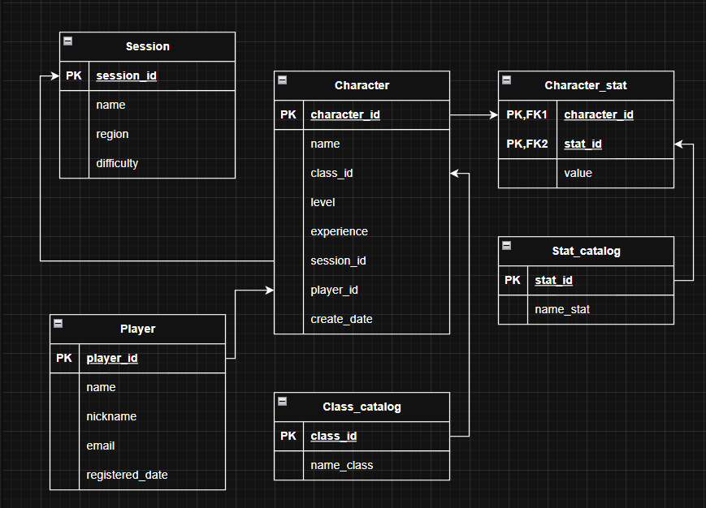

# Лабораторная работа №1

# Лабораторная работа №2
###

``` sql
CREATE TABLE "Emelyanov2271"."Player" (
    player_id INT PRIMARY KEY NOT NULL,
  name VARCHAR(50) NOT NULL,
  nickname VARCHAR(50) NOT NULL,
  email VARCHAR(255) NOT NULL UNIQUE,
  registered_date DATE
);

CREATE TABLE "Emelyanov2271"."Session"(
  session_id INT PRIMARY KEY NOT NULL,
  name VARCHAR(50) NOT NULL,
  region VARCHAR(50),
  difficulty INT NOT NULL DEFAULT 1
);

CREATE TABLE "Emelyanov2271"."Stat_catalog"(
  stat_id INT PRIMARY KEY NOT NULL,
  name_stat VARCHAR(50) NOT NULL
);

CREATE TABLE "Emelyanov2271"."Class_catalog"(
  class_id INT PRIMARY KEY NOT NULL,
  name_class VARCHAR(50) NOT NULL
);

CREATE TABLE "Emelyanov2271"."Character"(
  character_id INT PRIMARY KEY NOT NULL,
  name VARCHAR(50) NOT NULL DEFAULT 'Hero',
  class_id INT NOT NULL DEFAULT 0,
  level INT NOT NULL,
  experience INT NOT NULL,
  session_id INT NOT NULL  DEFAULT 0,
  player_id INT NOT NULL,
  create_date DATE
);

CREATE TABLE "Emelyanov2271"."Character_stat"(
  character_id INT NOT NULL,
    stat_id INT NOT NULL,
  PRIMARY KEY(character_id,stat_id),
  value INT NOT NULL
);
```
``` sql
INSERT INTO "Emelyanov2271"."Player"
(player_id, "name", nickname, email, registered_date) 
VALUES (0, 'kosty', 'kosty', 'kosty@yandex.ru', '21.09.25');

INSERT INTO "Emelyanov2271"."Player"
(player_id, "name", nickname, email, registered_date) 
VALUES (1, 'Vika', 'Akiv', 'Akiv@yandex.ru', '21.09.25');

INSERT INTO "Emelyanov2271"."Player"
(player_id, "name", nickname, email, registered_date) 
VALUES (2, 'Vadim', 'Midav', 'Midav@gmail.com', '21.09.25'),
(3, 'Nikita', 'Atikin', 'Atikin@gmail.com', '27.09.25');

INSERT INTO "Emelyanov2271"."Session"
(session_id, "name", region, difficulty) 
VALUES (0, 'Patygame', 'Russia', 2),
(1, 'kostygame', 'Russia', 1),
(2, 'Akivgame', 'Japan', 0),
(3, 'Midavgame', 'Europ', 1);

INSERT INTO "Emelyanov2271"."Stat_catalog"
(stat_id, name_stat) 
VALUES (0, 'Strength'),
(1, 'Agility'),
(2, 'Intelligence'),
(3, 'Endurance');

INSERT INTO "Emelyanov2271"."Class_catalog"
(class_id, name_class) 
VALUES (0, 'Warrior'),
(1, 'Archer'),
(2, 'Wizard'),
(3, 'Assassin');

INSERT INTO "Emelyanov2271"."Character"
(character_id, "name", class_id, "level", "experience", session_id, player_id, create_date) 
VALUES (0, 'Char1', 2, 6, 280, 0, 0, '22.09.25');

INSERT INTO "Emelyanov2271"."Character"
(character_id, "name", class_id, "level", "experience", session_id, player_id, create_date) 
VALUES (1, 'Char2', 1, 5, 970, 0, 2, '22.09.25'),
(2, 'Char3', 0, 5, 890, 2, 1, '25.09.25'),
(3, 'Char4', 3, 7, 100, 0, 3, '22.09.25');

INSERT INTO "Emelyanov2271"."Character"
(character_id, "name", class_id, "level", "experience", session_id, player_id, create_date) 
VALUES (4, 'Char5', 0, 6, 990, 0, 0, '22.09.25');

INSERT INTO "Emelyanov2271"."Character_stat"
(character_id, stat_id, "value") 
VALUES  (0, 0, 10),
	(0, 1, 14),
	(0, 2, 20),
	(0, 3, 8);
INSERT INTO "Emelyanov2271"."Character_stat"
(character_id, stat_id, "value") 
VALUES  (1, 0, 10),
	(1, 1, 18),
	(1, 2, 10),
	(1, 3, 14);
INSERT INTO "Emelyanov2271"."Character_stat"
(character_id, stat_id, "value") 
VALUES  (2, 0, 18),
	(2, 1, 12),
	(2, 2, 8),
	(2, 3, 16);
```
``` sql
SELECT 
  "Emelyanov2271"."Player".nickname,
  "Emelyanov2271"."Character".name,
  "Emelyanov2271"."Class_catalog".name_class,
  "Emelyanov2271"."Character".level,
  "Emelyanov2271"."Stat_catalog".name_stat,
  "Emelyanov2271"."Character_stat".value
FROM "Emelyanov2271"."Player"
INNER JOIN "Emelyanov2271"."Character"
  ON "Emelyanov2271"."Player".player_id = "Emelyanov2271"."Character".player_id
INNER JOIN "Emelyanov2271"."Character_stat"
  On "Emelyanov2271"."Character".character_id = "Emelyanov2271"."Character_stat".character_id
INNER JOIN "Emelyanov2271"."Stat_catalog"
  On "Emelyanov2271"."Stat_catalog".stat_id = "Emelyanov2271"."Character_stat".stat_id
INNER JOIN "Emelyanov2271"."Class_catalog"
  On "Emelyanov2271"."Character".class_id = "Emelyanov2271"."Class_catalog".class_id;
```
 
# Лабораторная работа №3
```sql
CREATE VIEW "Emelyanov2271".Session_Chars AS
	SELECT 
		"Emelyanov2271"."Session".name AS "Session Name",
		"Emelyanov2271"."Character".name AS "Character Name",
		"Emelyanov2271"."Class_catalog".name_class "Name Character class",
		"Emelyanov2271"."Character".level AS "Character level",
		"Emelyanov2271"."Character".experience AS "Experience",
		MAX(CASE WHEN "Character_stat".stat_id = '0' THEN value END) AS "Strength",
    		MAX(CASE WHEN "Character_stat".stat_id = '1' THEN value END) AS "Agility",
    		MAX(CASE WHEN "Character_stat".stat_id = '2' THEN value END) AS "Intelligence",
		MAX(CASE WHEN "Character_stat".stat_id = '3' THEN value END) AS "Endurance"
	FROM "Emelyanov2271"."Session" JOIN "Emelyanov2271"."Character"
	ON "Emelyanov2271"."Session".session_id = "Emelyanov2271"."Character".session_id
	JOIN "Emelyanov2271"."Character_stat"
	ON "Emelyanov2271"."Character".character_id = "Emelyanov2271"."Character_stat".character_id
	JOIN "Emelyanov2271"."Stat_catalog" sc
	ON "Emelyanov2271"."Character_stat".stat_id = sc.stat_id
	JOIN "Emelyanov2271"."Class_catalog"
	ON "Emelyanov2271"."Class_catalog".class_id = "Emelyanov2271"."Character".class_id
	GROUP BY  
		"Emelyanov2271"."Session".name,
		"Emelyanov2271"."Character".name,
		"Emelyanov2271"."Character".level,
		"Emelyanov2271"."Character".experience,
		"Emelyanov2271"."Class_catalog".name_class
	ORDER BY "Emelyanov2271"."Session".name ASC
```

```sql
CREATE OR REPLACE PROCEDURE "Emelyanov2271".get_session_char(
    IN session_name_filter VARCHAR DEFAULT NULL,
    IN min_level INTEGER DEFAULT 0,
    IN max_level INTEGER DEFAULT 100,
    INOUT result_refcursor REFCURSOR DEFAULT 'session_chars_cursor'
)
AS $$
BEGIN
    OPEN result_refcursor FOR
        SELECT *
        FROM "Emelyanov2271".Session_Chars
        WHERE (session_name_filter IS NULL OR "Session Name" ILIKE '%' || session_name_filter || '%')
          AND "Character level" BETWEEN min_level AND max_level
        ORDER BY "Session Name", "Character level" DESC;
END;
$$LANGUAGE plpgsql;

CREATE OR REPLACE PROCEDURE "Emelyanov2271".get_session_char(
    IN session_name_filter VARCHAR DEFAULT NULL,
    IN min_level INTEGER DEFAULT 0,
    IN max_level INTEGER DEFAULT 100
)
AS $$
DECLARE
    rec RECORD;
BEGIN
    FOR rec IN 
        SELECT *
        FROM "Emelyanov2271".Session_Chars
        WHERE (session_name_filter IS NULL OR "Session Name" ILIKE '%' || session_name_filter || '%')
        AND "Character level" BETWEEN min_level AND max_level
        ORDER BY "Session Name", "Character level" DESC
    LOOP
        RAISE NOTICE 'Session: %, Name: %, Class: %, level: %, Strength: %, Agility: %, Intelligence: %, Endurance: %', rec."Session Name", rec."Character Name", 
			rec."Name Character class", rec."Character level", rec."Strength", rec."Agility", rec."Intelligence", rec."Endurance";
    END LOOP;
END;
$$ LANGUAGE plpgsql;
```

```sql
CREATE OR REPLACE FUNCTION "Emelyanov2271".stat_up(
    stat_name VARCHAR,
    change_value INTEGER,
    char_id INTEGER
) RETURNS VOID AS $$
DECLARE
    st_id INTEGER;
    current_value INTEGER;
    new_value INTEGER;
BEGIN
    SELECT sc.stat_id INTO st_id
    FROM "Emelyanov2271"."Stat_catalog" sc
    WHERE sc.name_stat = stat_name;
    
    IF st_id IS NULL THEN
        RAISE EXCEPTION 'характкристика "%" не найдена в каталоге', stat_name;
    END IF;

    SELECT cs.value INTO current_value
    FROM "Emelyanov2271"."Character_stat" cs
    WHERE cs.character_id = char_id
    AND cs.stat_id = st_id;

    IF current_value IS NULL THEN
        RAISE EXCEPTION 'характкристика "%" не найдена для персонажа %', stat_name, char_id;
    END IF;

    new_value := current_value + change_value;

    UPDATE "Emelyanov2271"."Character_stat"
    SET value = new_value
    WHERE "Emelyanov2271"."Character_stat".character_id = char_id
    AND "Emelyanov2271"."Character_stat".stat_id = st_id;
    
    IF NOT FOUND THEN
        RAISE EXCEPTION 'Не удалось обновить характкристику "%" для персонажа %', stat_name, char_id;
    END IF;
    
END;
$$ LANGUAGE plpgsql;
```
```sql
CREATE OR REPLACE PROCEDURE "Emelyanov2271".proc_stat_up(
    IN character_id INTEGER,
    IN strength INTEGER,
    IN agility INTEGER,
    IN intelligence INTEGER,
    IN endurance INTEGER
)
AS $$
BEGIN
    IF strength <> 0 THEN
        PERFORM "Emelyanov2271".stat_up('Strength', strength, character_id);
    END IF;

    IF agility <> 0 THEN
        PERFORM "Emelyanov2271".stat_up('Agility', agility, character_id);
    END IF;

    IF intelligence <> 0 THEN
        PERFORM "Emelyanov2271".stat_up('Intelligence', intelligence, character_id);
    END IF;

    IF endurance <> 0 THEN
        PERFORM "Emelyanov2271".stat_up('Endurance', endurance, character_id);
    END IF;

    RAISE NOTICE 'Статы успешно обновлены';
EXCEPTION
    WHEN OTHERS THEN
        RAISE NOTICE 'Произошла ошибка: %', SQLERRM;
END;
$$ LANGUAGE plpgsql;

CALL "Emelyanov2271".proc_stat_up(0, 1, 1, 1, 1);
```

# Лабораторная работа №4
```sql
INSERT INTO "Emelyanov2271"."Player" (player_id, name, nickname, email, registered_date)
SELECT
    i,
    'Player_' || i,
    'Nick_' || i,
    'player' || i || '@example.com',
    CURRENT_DATE - (RANDOM() * 365)::int
FROM generate_series(5, 20000) AS i;


INSERT INTO "Emelyanov2271"."Session" (session_id, name, region, difficulty)
SELECT
    i,
    'Session_' || i,
    CASE (RANDOM() * 4)::int
        WHEN 0 THEN 'Europ'
        WHEN 1 THEN 'Asia'
        WHEN 2 THEN 'NA'
	WHEN 3 THEN 'Japan'
	WHEN 4 THEN 'Russia'
        ELSE 'SA'
    END,
    (RANDOM() * 2)::int + 1
FROM generate_series(4, 20000) AS i;

 
INSERT INTO "Emelyanov2271"."Character" (
    character_id, name, class_id, level, experience, session_id, player_id, create_date
)
SELECT
    i,
    'Char_' || i,
    (RANDOM() * 2)::int + 1,
    (RANDOM() * 100)::int + 1,
    (RANDOM() * 10000)::int,
    (RANDOM() * 20000)::int + 1,
    (RANDOM() * 20000)::int + 1, 
    CURRENT_DATE - (RANDOM() * 180)::int 
FROM generate_series(5, 20000) AS i;
```
```sql
CREATE INDEX char_player ON "Emelyanov2271"."Character" (player_id);
CREATE INDEX char_class ON "Emelyanov2271"."Character" (class_id);
CREATE INDEX char_level ON "Emelyanov2271"."Character" (level);
CREATE INDEX player_registered_date ON "Emelyanov2271"."Player"(registered_date);
```

```sql
EXPLAIN (ANALYZE, BUFFERS)
SELECT 
	P.player_id,
	P.name,
	P.email,
	Ch.name,
	Ch.level,
	Cc.name_class,
	P.registered_date
FROM "Emelyanov2271"."Player" P
JOIN "Emelyanov2271"."Character" Ch ON P.player_id = Ch.player_id 
JOIN "Emelyanov2271"."Class_catalog" Cc ON Ch.class_id = Cc.class_id
WHERE P.registered_date > DATE '2025-07-01' AND Ch.level < 29;
```

# Лабораторная работа №5
```sql
CREATE TABLE IF NOT EXISTS "Emelyanov2271"."AuditLog" (
    log_id SERIAL PRIMARY KEY,
    table_name VARCHAR(50) NOT NULL,
    operation VARCHAR(10) NOT NULL,
    operation_time TIMESTAMP DEFAULT CURRENT_TIMESTAMP,
    old_data JSONB,
    new_data JSONB
)
```

```sql
CREATE OR REPLACE FUNCTION "Emelyanov2271".log_player_changes()
RETURNS TRIGGER AS $$
BEGIN
    IF TG_TABLE_NAME = 'Player' THEN
        IF TG_OP = 'INSERT' THEN
            INSERT INTO "Emelyanov2271"."AuditLog" 
            (table_name, operation)
            VALUES ('Player', 'INSERT');

        ELSIF TG_OP = 'UPDATE' THEN
            INSERT INTO "Emelyanov2271"."AuditLog"
            (table_name, operation)
            VALUES ('Player', 'UPDATE');

        ELSIF TG_OP = 'DELETE' THEN
            WITH player_characters AS (
                SELECT character_id 
                FROM "Emelyanov2271"."Character" 
                WHERE player_id = OLD.player_id
            ),
            deleted_stats AS (
                DELETE FROM "Emelyanov2271"."Character_stat" cs
                WHERE cs.character_id IN (SELECT character_id FROM player_characters)
                RETURNING cs.*
            )
            INSERT INTO "Emelyanov2271"."AuditLog" (table_name, operation, old_data)
            SELECT 'Character_stat', 'DELETE', row_to_json(ds)
            FROM deleted_stats ds;
            
            DELETE FROM "Emelyanov2271"."Character" 
            WHERE player_id = OLD.player_id;
            
            INSERT INTO "Emelyanov2271"."AuditLog"
            (table_name, operation, old_data)
            VALUES ('Player', 'DELETE', row_to_json(OLD));
        END IF;
        
    ELSIF TG_TABLE_NAME = 'Character' THEN
        IF TG_OP = 'INSERT' THEN
            INSERT INTO "Emelyanov2271"."AuditLog" 
            (table_name, operation)
            VALUES ('Character', 'INSERT');

        ELSIF TG_OP = 'UPDATE' THEN
            INSERT INTO "Emelyanov2271"."AuditLog"
            (table_name, operation)
            VALUES ('Character', 'UPDATE');

        ELSIF TG_OP = 'DELETE' THEN
            WITH deleted_stats AS (
                DELETE FROM "Emelyanov2271"."Character_stat" 
                WHERE character_id = OLD.character_id
                RETURNING *
            )
            INSERT INTO "Emelyanov2271"."AuditLog" (table_name, operation, old_data)
            SELECT 'Character_stat', 'DELETE', row_to_json(ds)
            FROM deleted_stats ds;
            
            INSERT INTO "Emelyanov2271"."AuditLog"
            (table_name, operation, old_data)
            VALUES ('Character', 'DELETE', row_to_json(OLD));
        END IF;
    
    ELSIF TG_TABLE_NAME = 'Character_stat' THEN
        IF TG_OP = 'INSERT' THEN
            INSERT INTO "Emelyanov2271"."AuditLog" 
            (table_name, operation)
            VALUES ('Character_stat', 'INSERT');

        ELSIF TG_OP = 'UPDATE' THEN
            INSERT INTO "Emelyanov2271"."AuditLog"
            (table_name, operation)
            VALUES ('Character_stat', 'UPDATE');

        ELSIF TG_OP = 'DELETE' THEN
            INSERT INTO "Emelyanov2271"."AuditLog"
            (table_name, operation, old_data)
            VALUES ('Character_stat', 'DELETE', row_to_json(OLD));
        END IF;
    END IF;
    
    RETURN (CASE WHEN TG_OP = 'DELETE' THEN OLD ELSE NEW END);
END;
$$ LANGUAGE plpgsql;
```

```sql
CREATE TRIGGER player_audit_trigger
BEFORE INSERT OR UPDATE OR DELETE ON "Emelyanov2271"."Player"
FOR EACH ROW EXECUTE FUNCTION "Emelyanov2271".log_player_changes();

CREATE TRIGGER character_audit_trigger
BEFORE INSERT OR UPDATE OR DELETE ON "Emelyanov2271"."Character"
FOR EACH ROW EXECUTE FUNCTION "Emelyanov2271".log_player_changes();

CREATE TRIGGER character_stat_audit_trigger
BEFORE INSERT OR UPDATE OR DELETE ON "Emelyanov2271"."Character_stat"
FOR EACH ROW EXECUTE FUNCTION "Emelyanov2271".log_player_changes();
```

```sql
INSERT INTO "Emelyanov2271"."Player" (player_id, name, nickname, email, registered_date)
VALUES (20121, 'asd', 'ivan', 'ivan@gmail.com', '2025-12-25')

INSERT INTO "Emelyanov2271"."Character" (character_id, name, class_id, level, experience, session_id, player_id, create_date)
VALUES (1, 'zxc', 1, 10, 1000, 1, 20121, '2025-12-21');

INSERT INTO "Emelyanov2271"."Character_stat" (character_id, stat_id, value)
VALUES (1, 1, 100), (1, 2, 50), (1, 3, 75);

DELETE FROM "Emelyanov2271"."Player" WHERE player_id = 20121
```
